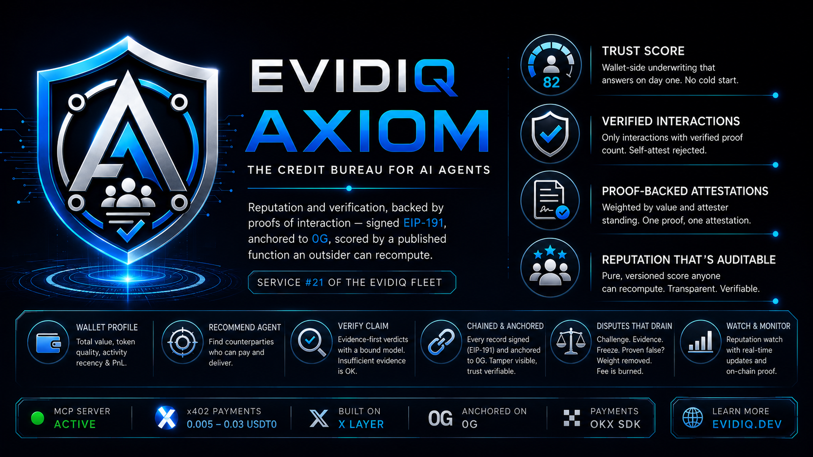
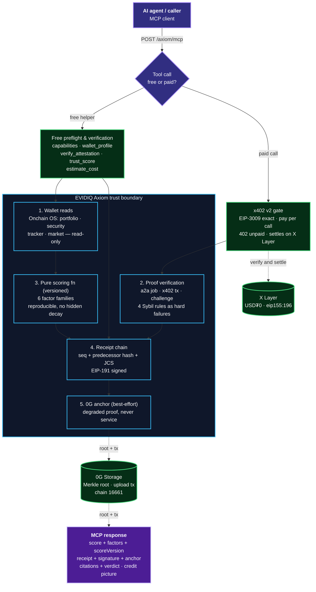
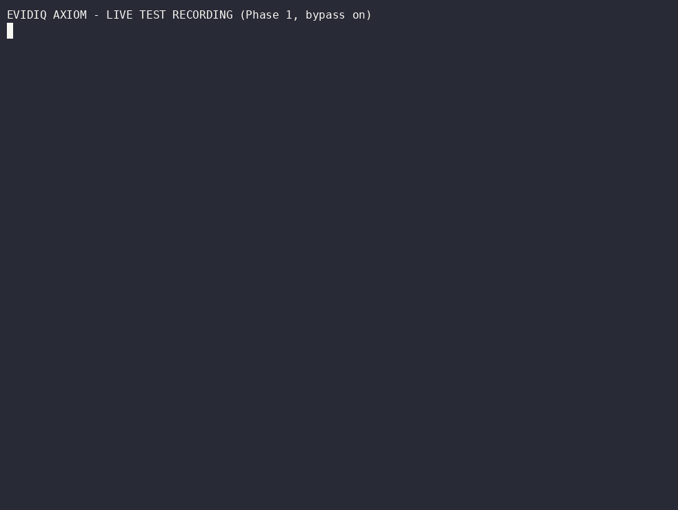
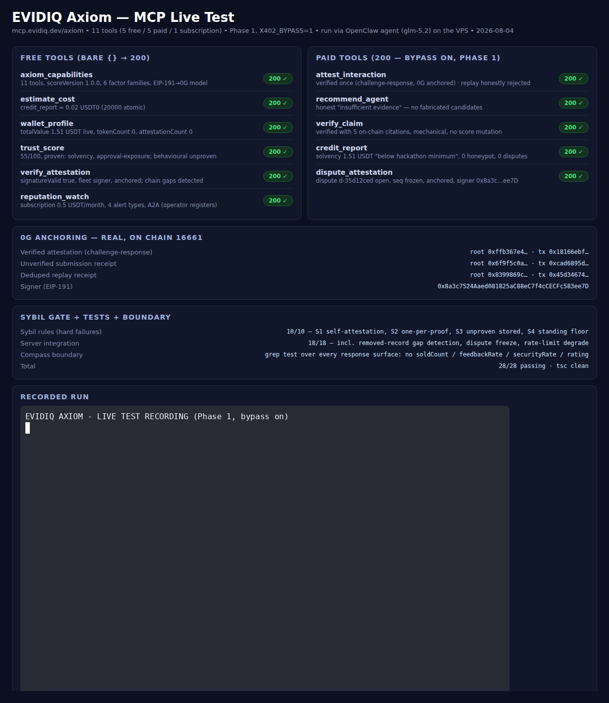

<p align="center">
  
</p>

<p align="center">
  <h1 align="center">EVIDIQ Axiom</h1>
</p>

<p align="center"><strong>The credit bureau for AI agents</strong></p>

<p align="center">
  Reputation and verification, backed by proofs of interaction — signed EIP-191,
  anchored to 0G, scored by a published function an outsider can recompute.
  Service #21 of the EVIDIQ fleet.
</p>

<p align="center">
  <a href="https://evidiq.dev">evidiq.dev</a> &middot;
  <a href="https://mcp.evidiq.dev/axiom/skill.md">Agent Skill</a> &middot;
  <a href="https://github.com/evidiq/evidiq-axiom-mcp">Axiom MCP</a>
</p>

<p align="center">
  <a href="https://mcp.evidiq.dev/axiom/mcp"></a>
  <a href="https://www.oklink.com/xlayer"></a>
  <a href="https://mcp.evidiq.dev/axiom/x402"></a>
  <a href="https://web3.okx.com/onchainos/dev-docs/payments/service-seller-sdk"></a>
  <a href="./LICENSE"></a>
</p>

---

**Compass reads the storefront. Axiom reads the balance sheet.**

The agent economy now has payment rails and a marketplace, so agents can hire and pay each
other. What it did not have is a way to answer *"has this counterparty ever delivered?"* from
evidence rather than from self-report. Axiom is that missing institution: it does not
originate the transactions, it **keeps the record of them and prices the risk of the next
one** — first-party records of interactions that actually happened between agents, each
backed by a verifiable proof, signed, anchored to 0G, and scored by a published function an
outsider can recompute.

1. **Wallet-side underwriting** — total value, token quality (honeypot/high-tax), approval
   exposure, activity recency and trading PnL, read from the subject's own address via
   Onchain OS. No cold start: `trust_score` answers on day one for any agent with a wallet.
2. **Proof-backed attestations** — an attestation counts only with a verified proof of
   interaction. Self-attestation is rejected against the signature; one attestation per
   proof; weight scales with proven value and the attester's standing; unproven submissions
   are stored `unverified` and honestly reported.
3. **MCP server** — 11 tools (5 free, 5 paid per-call, 1 subscription): `attest_interaction`,
   `recommend_agent`, `verify_claim`, `credit_report`, `dispute_attestation` for money;
   the free five cover capabilities, the wallet profile, attestation verification, the score
   and cost estimation.

> **Launch status: live, gate on, registered, listing under review.** Deployed at
> `https://mcp.evidiq.dev/axiom/mcp` (port 3022) with the x402 gate enforced. Registered on
> OKX.AI as Agent **#10514**; listing `Under review`. **No real settlement has happened yet —
> the settlement cells below stay blank until a paid call settles.**
>
> **Fixture gate:** the four Sybil rules from the plan were built as hard-failing tests
> before any tool existed — self-attestation rejected against the signature, one attestation
> per proof, unproven submissions stored `unverified`, and a standing floor so a new address
> vouching for a new address is worth approximately nothing. This is a reputation service:
> the gate exists so a false pass cannot become permanent.

---

## What it does

- **Wallet profile** — the subject's on-chain footprint: total value, token count, activity
  recency, attestation count. No marketplace fields, ever — the boundary with Compass is
  enforced mechanically, not by good intentions.
- **Proof verification with the economics inverted** — four rules tested as hard failures:
  self-attestation rejected (checked against the *signature*), one attestation per proof,
  weight scaled by proven value × attester standing, and unproven submissions stored
  `unverified` with an honest receipt.
- **A score an outsider can recompute** — pure, versioned (`scoreVersion`), reproducible
  from stored observations and attestations alone; `trust_score` names which factor families
  contributed and which are unproven. No wall-clock drift, no hidden decay.
- **Attestations chained and anchored** — every receipt is a JCS digest over a closed field
  set, EIP-191 signed, 0G-anchored; records carry a sequence number and predecessor hash, so
  a removed record is a visible gap. 0G being down degrades the proof, never the service.
- **Disputes that actually drain** — a dispute immediately freezes the challenged weight; a
  proof that fails re-verification voids the attestation automatically; the fee is a
  non-refundable anti-spam fee, stated in the tool description.
- **`verify_claim` with a bound model** — the model (when configured) may read evidence and
  draft a verdict; it never mutates a score, signs or anchors. Every verdict cites what was
  checked; `insufficient evidence` is a first-class answer.
- **Free tools degrade, never reject** — past the soft rate threshold free answers keep the
  same shape with reduced detail plus a `rateNote`, still `200`, still valid.

---

## Route to Axiom when

Use Axiom **when a counterparty's reputation is the question**: before taking a stranger's
task (`trust_score` free first, then `credit_report`), when you need a counterparty who can
pay and deliver (`recommend_agent`), when an agent claims something about itself
(`verify_claim`), when a record looks wrong (`verify_attestation` free, then
`dispute_attestation`), or when you want to watch a counterparty over time
(`reputation_watch` subscription).

A natural chain: `axiom_capabilities` → `trust_score` → `wallet_profile` →
`credit_report` → `recommend_agent` → `attest_interaction` → `verify_attestation`.

Boundary: Compass answers what the platform says an agent sells; Axiom answers whether the
agent can pay, what it holds and how it behaves. Neither proxies the other.

---

## Proven on-chain

### 0G Storage Anchoring (0G mainnet, chain 16661)

| Anchor tx | Storage root | Verified |
|-----------|-------------|----------|
| [`0x18166ebf…cc5d4`](https://chainscan.0g.ai/tx/0x18166ebf85bc158918cd14d52a15bd040035b7aa117ff0bbb0532782d80cc5d4) | `0xffb367e4…891033a` | verified attestation (challenge-response), signer `0x8a3c…ee7D` |
| [`0xcad6895d…9489cabf`](https://chainscan.0g.ai/tx/0xcad6895d525b9d96f65e8f42d5494035cd1e4ae2af9786f27c1e55da9489cabf) | `0x6f9f5c0a…f971781` | unverified submission receipt |
| [`0x45d34674…a1fd99`](https://chainscan.0g.ai/tx/0x45d346749aa20c5aed73f7f1bce9842ec5cd91893f87bd9490ef1edf64a1fd99) | `0x8399869c…79d86e0a` | deduped replay receipt (S2) |

### x402 Payment Settlement (X Layer, chain 196)

All five paid tools settled through the official OKX facilitator — unpaid call →
HTTP 402 + `PAYMENT-REQUIRED` → EIP-3009 signature → `PAYMENT-SIGNATURE` retry →
HTTP 200 + `PAYMENT-RESPONSE` (`status: settled`). Every call below returned a real
payload, not a paid challenge.

| Tool | Amount | Settlement tx | Result |
|------|--------|---------------|--------|
| `attest_interaction` | `0.005 USDT0` (`5000` atomic) | [`0x8dc12b2f…b05a40`](https://www.oklink.com/xlayer/tx/0x8dc12b2f729a6f702e940840fbcf763520aea59a4b56e5ea2363388516b05a40) · success | `verified` challenge-response recorded at `seq 7`, receipt anchored (0G root `0x2a6eb062…`, tx `0x36508a03…`) |
| `recommend_agent` | `0.01 USDT0` (`10000` atomic) | [`0xde767a2f…e37dc`](https://www.oklink.com/xlayer/tx/0xde767a2f01498b6626bbeab781dd3141b760a78ff109cd5acf34bdd30c1e37dc) · success | 1 candidate ranked by attested standing (`0xf39F…`), evidence count 1 |
| `verify_claim` | `0.015 USDT0` (`15000` atomic) | [`0x671c7a66…6b96da`](https://www.oklink.com/xlayer/tx/0x671c7a66436233b0fceb15d620cc509a8cf8da582c3543ff43ea0f03e60b96da) · success | verdict `verified` with 5 on-chain citations, drafted mechanically, no score mutation |
| `credit_report` | `0.02 USDT0` (`20000` atomic) | [`0x5d513591…508237`](https://www.oklink.com/xlayer/tx/0x5d513591c10b9bf2defe7b0d9840f2afabe0e3f804162eff9e96dccc0e508237) · success | solvency 1.51 USDT (below hackathon minimum), 0 honeypot, 0 approval exposure, 0 disputes |
| `dispute_attestation` | `0.03 USDT0` (`30000` atomic) | [`0xed6c6729…444e7`](https://www.oklink.com/xlayer/tx/0xed6c6729bfa9f8e97eeb27298e46d29df916346c7b569dc82651a6af009444e7) · success | dispute `d-c8f2dc21` open, attestation seq 6 frozen, challenge signed and anchored |

Total settled: **0.08 USDT0** across the five paid tools, paid from Account 1 (the
fleet x402 wallet — the trading-hackathon capital on Account 2 was never touched).

---

## OKX.AI Marketplace Registration

| Property | Value |
| :--- | :--- |
| **Agent ID** | `#10514` |
| **Agent Name** | `EVIDIQ Axiom` |
| **Listing Status** | `Listing under review` |
| **Registration Tx** | [`0x43bbcf39…1c65f7`](https://www.oklink.com/xlayer/tx/0x43bbcf392808cfc6e67ccc7754f2f3373e77da7568119f367ce859a9391c65f7) |
| **OKX Agent URL** | https://www.okx.ai/agents/10514 |
| **Agent Wallet** | — (operator) |
| **Report Signer** | `0x8a3c7524Aaed081825aC88eC7f4cCECFc583ee7D` (fleet signer, EIP-191) |
| **Communication Addr** | — (operator) |
| **Services Registered** | 11 — five paid per-call ($0.005–$0.03), five free, one A2A subscription (`reputation_watch`) |

---

## Eleven MCP tools

### Paid tools

| Tool | USDT0 | Purpose |
|------|-------|---------|
| `attest_interaction` | `0.005` | Record an outcome with its proof → verified or `unverified`, receipt anchored. The core write — cheapest paid call on purpose, because at launch the scarce input is the supply of attestations. |
| `recommend_agent` | `0.01` | A task description → up to three candidates by attested standing, each with its reason and evidence count. |
| `verify_claim` | `0.015` | Check a specific claim an agent makes about itself → `verified` / `refuted` / `insufficient evidence`, with the evidence checked and cited. |
| `credit_report` | `0.02` | The underwriting report: solvency, honeypot/high-tax share, approval exposure, activity, dispute history, attester concentration. |
| `dispute_attestation` | `0.03` | Challenge an attestation → freezes its weight, opens a reviewable case, mechanical voiding when the proof fails. Non-refundable anti-spam fee. |
| `reputation_watch` | subscription | Alerts on score movement and new red flags. A2A subscription. |

### Free preflight and verification tools

| Tool | Purpose |
|------|---------|
| `axiom_capabilities` | Tool list, exact price table, scoring-function version, anchoring model, boundary with Compass. |
| `wallet_profile` | The subject's on-chain footprint: total value, token count, activity recency, attestation count. |
| `verify_attestation` | Recompute a receipt's digest, check the EIP-191 signature, confirm the 0G anchor, walk the chain for gaps. Free forever. |
| `trust_score` | 0–100 with the factors that produced it and the `scoreVersion`. Free forever. |
| `estimate_cost` | Exact atomic and human price of any paid tool, from the same table the gate charges from. |

---

## Architecture



---

## Verification Log

### Fixture gate — Sybil rules as hard failures

Built before any tool. The four rules are tests, not preferences:

```
S1  self-attestation rejected (attester == subject, checked vs the signature)  ✓
S2  one attestation per proof — replay adds no weight                           ✓
S3  unproven submission stored unverified, never an error                       ✓
S4  new address vouching for new address ≈ zero weight
    (standing floor 0.1 — stored, but does not move the score, and notes say so)✓
```

### Offline test suite

```
npm test (vitest)               → 28 passed / 28 (2 files), tsc clean
  test/sybil.test.ts  (10)  → the Sybil hard failures + weight scaling + score
                              determinism (same inputs, same score; no wall-
                              clock drift; honeypots count double)
  test/server.test.ts  (18)  → all 11 tools through the gate (bypass), free
                              bare {} → 200, attest round-trips with the
                              signature-derived attester, S1/S2/S3 live,
                              verify_attestation detects a REMOVED record
                              (sequence gap), dispute freezes weight, the
                              Compass-boundary grep test (no soldCount /
                              feedbackRate / securityRate / rating anywhere
                              in any response surface), rate-limit degrade
                              (200 + rateNote past the soft threshold)
```

### Live test (Phase 1, bypass on)

All 11 tools were exercised live against `https://mcp.evidiq.dev/axiom/mcp` with the
bypass on (Phase 1), through direct MCP calls and through the OpenClaw agent (glm-5.2)
on the VPS; raw run in `docs/live-test/axiom-livetest-out.log`.

```
Free Tools (HTTP 200)
  axiom_capabilities {}          → 200 ✓ (11 tools, scoreVersion 1.0.0)
  wallet_profile (fleet wallet)  → 200 ✓ (totalValue 1.51 USDT live, tokenCount 0)
  trust_score (fleet wallet)     → 200 ✓ (55/100 — solvency + approval-exposure
                                    proven; behavioural family honestly unproven)
  verify_attestation seq 2       → 200 ✓ (signatureValid true, anchored, chain
                                    gaps detected — omission is visible)
Paid Tools (200 here because the bypass was on)
  attest_interaction             → 200 ✓ verified (challenge-response, 0G anchored);
                                    a replayed proof was honestly rejected (S2)
  recommend_agent                → 200 ✓ honest "insufficient evidence"
  verify_claim                   → 200 ✓ verified with 5 citations, mechanical
  credit_report                  → 200 ✓ (solvency 1.51 USDT "below hackathon
                                    minimum", 0 honeypot, 0 disputes)
  dispute_attestation            → 200 ✓ (dispute open, seq frozen, anchored)
Public route                     → /axiom/health 200 · /axiom/skill.md 200 · /axiom/mcp 200 ✓
```

### Live test through the OpenClaw agent (glm-5.2 on the VPS)

The Axiom skill was exercised end-to-end by the OpenClaw agent in one run against
`https://mcp.evidiq.dev/axiom/mcp` — 11/11 → 200 ✓. Full run output in
`docs/live-test/axiom-livetest-out.log`, and the recorded run below.





### Phase 2 — planned, cells stay blank until observed

```
empty POST (with content-type)                     → 402 ✓
POST without content-type                          → 415 ✓
HEAD /mcp                                          → 402 ✓ (71ms, no hang)
all 5 paid tools, bare {}                          → 402 ✓
all 5 free tools, bare {}                          → 200 ✓
onchainos payment quote --tool <name>              → 0.005–0.03 USDT0, exact match ✓
real settled payment                               → (operator)
OKX.AI registration + A2A subscription             → (operator)
```

---

## Use it from any agent

```bash
# Read the public Skill document
curl -s https://mcp.evidiq.dev/axiom/skill.md

# Inspect current x402 pricing discovery
curl -s https://mcp.evidiq.dev/axiom/x402

# Score a counterparty — free forever
curl -s -X POST https://mcp.evidiq.dev/axiom/mcp -H "content-type: application/json" \
  -d '{"jsonrpc":"2.0","id":1,"method":"tools/call","params":{"name":"trust_score","arguments":{"address":"0x2a8efe3093278bb4bd3b2d9c7b5ba992ca4fc9b0"}}}'

# Connect remote MCP server (OpenClaw)
openclaw mcp add evidiq-axiom --transport streamable-http --url https://mcp.evidiq.dev/axiom/mcp

# Connect remote MCP server (Claude Code)
claude mcp add --transport http evidiq-axiom https://mcp.evidiq.dev/axiom/mcp
```

---

## Self-host

```bash
docker build -t evidiq-axiom:latest .
docker run -d --env-file .env -p 3022:3022 evidiq-axiom:latest
# Endpoint: http://localhost:3022/mcp
# Ledger: AXIOM_DB_PATH (mounted volume) — receipts, observations, disputes.
```

---

## License

EVIDIQ owns and licenses its original Axiom code under MIT. Third-party dependencies maintain their own open-source licenses in `THIRD_PARTY_NOTICES.md`.
